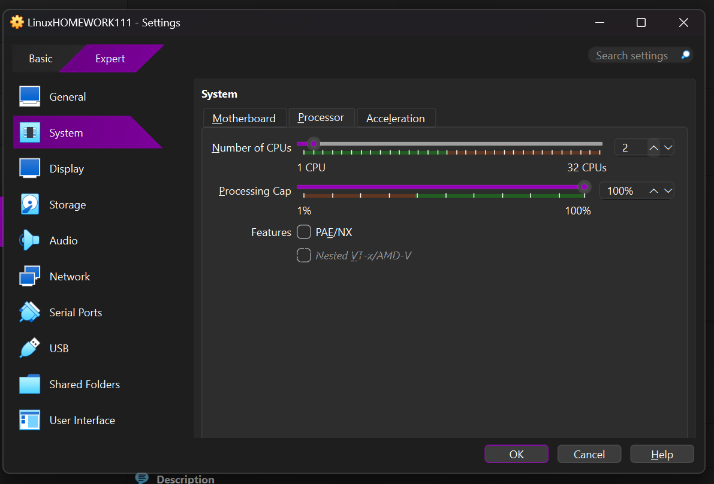

# Linux期末大作业

作者：计算机科学与技术 三班 朱林立

[GitHub主页](https://github.com/Megalomanian)

虚拟机账号：student

虚拟机密码：student

虚拟机文件`LinuxHOMEWORK111.ova`以ova格式导出，如需导入virtual box或vm ware中检查，可[参考此文章](https://blog.csdn.net/weixin_43031313/article/details/129897809)

## 题目1：在virtual box中安装archlinux

下载archlinux的iso并导入

系统配置CPU、内存、显存、硬盘




ping检查网络，同步时间

```plaintext
ping www.baidu.com -c 3
timedatectl set-ntp true
```

分区

```plaintext
cfdisk /dev/sda
```


配置镜像源

```plaintext
vim /etc/pacman.d/mirrorlist
```

dd剪切清华源，p黏贴到第一行


安装基础系统里要用的东西（如果配置了镜像源就可以加速下载环节）

```plaintext
pacstrap /mnt base linux linux-firmware vim networkmanager sudo zsh
```


生成fstab，进系统

```plaintext
genfstab -U /mnt >> /mnt/etc/fstab
cat /mnt/etc/fstab   # 这条命令用于确认分区
arch-chroot /mnt
```


## 题目2：设置hostname为学号

```plaintext
echo 12024242193 > /etc/hostname
```

vim改hosts

```plaintext
vim /etc/hosts

127.0.0.1   localhost
::1         localhost
127.0.1.1   12024242193.localdomain 12024242193
```

[https://www.notion.so](https://www.notion.so)

## 题目3：设置时区

```plaintext
ln -sf /usr/share/zoneinfo/Asia/Shanghai /etc/localtime
hwclock --systohc       # 生成 /etc/adjtime
```

## 题目4：创建普通用户 + wheel 组 + sudo

设置root密码：

```plaintext
passwd
```

创建普通student用户，设置密码：

```plaintext
useradd -m -G wheel -s /bin/bash student
passwd student
```

允许wheel用户组使用sudo：

```plaintext
EDITOR=vim visudo
```


## 题目5：把普通用户的shell切换到zsh

1. 修改用户 shell（之前装过zsh了）：

```bash
chsh -s /bin/zsh student
```


## 题目1（后半部分）：此时安装引导（GRUB，BIOS + MBR）

```bash
pacman -S grub
grub-install --target=i386-pc /dev/sda
grub-mkconfig -o /boot/grub/grub.cfg
```


## 题目 6：安装图形界面 + 开机启动（5 分）

### 1. 安装 X 相关

```bash
pacman -S xorg-server xorg-apps xorg-xinit
```

### 2. 安装XFCE（这个桌面环境我用着比较习惯）

```bash
pacman -S xfce4 xfce4-goodies lightdm lightdm-gtk-greeter
```

### 3. 开机自启图形登录管理器（以 lightdm 为例）

```bash
systemctl enable lightdm
```

重启一下进入图形化界面


## 题目7：安装浏览器（谷歌或者火狐，我这块都装了）

```bash
pacman -S firefox # 装火狐
pacman -S chromium # 装谷歌
```


## 题目8：设置中文字体

改/etc/locale.gen，取消这两行的注释：


设置默认语言：

```plaintext
echo 'LANG=zh_CN.UTF-8' > /etc/locale.conf
```

装中文字体：

```plaintext
pacman -S noto-fonts-cjk wqy-microhei
```


重新生成本地信息：


reboot重启：


## 题目9：安装输入法，开机自启

```plaintext
pacman -S fcitx5 fcitx5-chinese-addons fcitx5-gtk fcitx5-qt
```

改/etc/environments


重启测试输入法


## 题目10：安装nginx设置端口8080开机自启

安装

```plaintext
pacman -S nginx
```

改配置文件/etc/nginx/nginx.conf


设置开机自启

```plaintext
systemctl enable --now nginx
```


## 题目 11：安装 sshd，端口 2222，开机启动

运行命令：

```plaintext
pacman -S openssh
vim /etc/ssh/sshd_config

#将Port 22改2222
```


启动并配置开机自启

```plaintext
systemctl enable --now sshd
```

测试：


## 题目12：system_info 脚本

将以下内容写入/usr/local/bin/system_info

```plaintext
#!/usr/bin/env bash

USER_NAME=$(whoami)

CURRENT_SHELL="$SHELL"

MEM_USAGE=$(free | awk '/Mem:/ {printf("%.2f%%", $3/$2*100)}')

DISK_USAGE=$(df -h / | awk 'NR==2 {print $5}')

echo "Current user: ${USER_NAME}"
echo "Current shell: ${CURRENT_SHELL}"
echo "Memory usage: ${MEM_USAGE}"
echo "Disk usage (/): ${DISK_USAGE}"
```

赋予执行权限，运行


